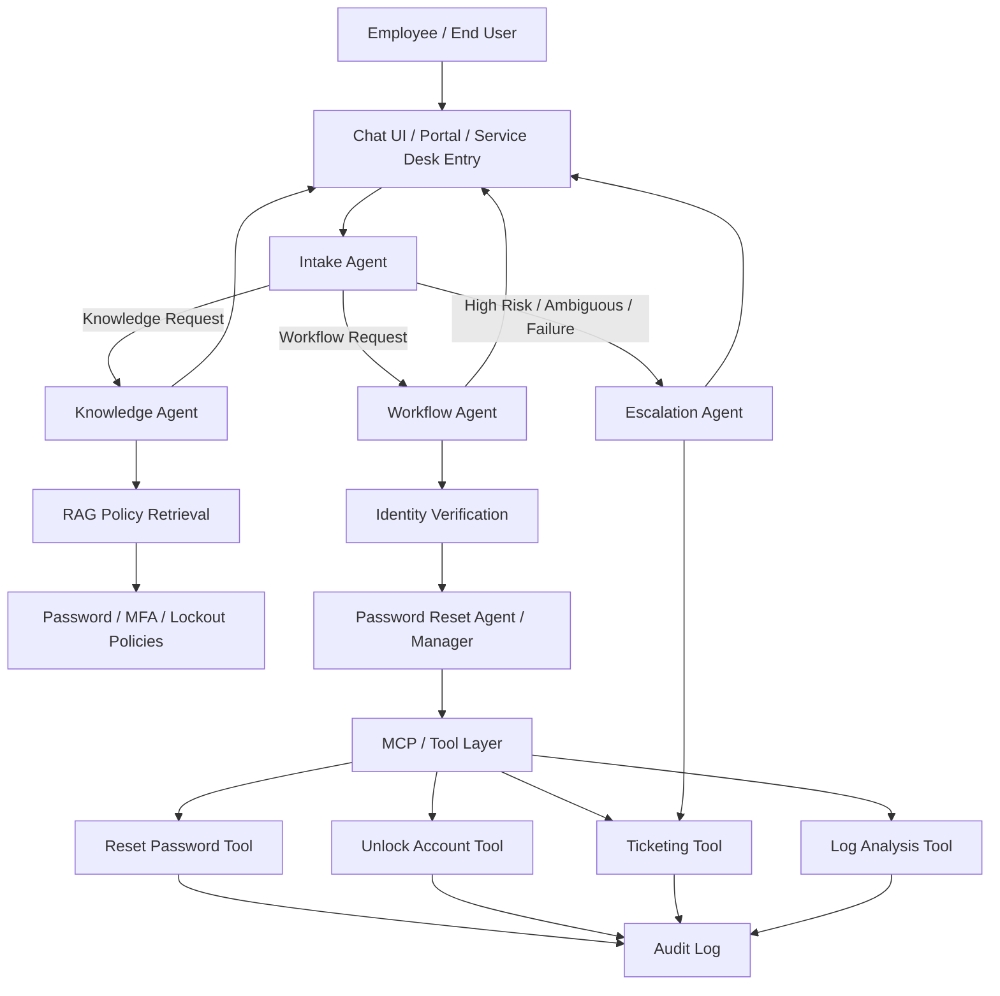
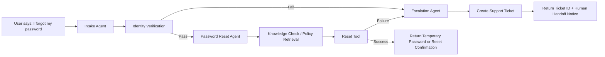

# IT Workflow Process

## Overview

This workflow process describes an **AI-assisted IT operations system** that automates common support tasks and orchestrates handoffs across specialized agents. It is modeled after a multi-agent IT support pattern similar to the public `mikeshuh/IT-Support-ChatBot` repository, where requests are routed through **intake, knowledge, workflow, and escalation paths** and where **workflow actions** cover tasks such as ticketing, password reset support, and log analysis. The password reset portion is also adapted to reflect the use case demonstrated in the uploaded notebook: a **Password Reset Agent/Manager** with identity verification, policy-grounded guidance, reset execution, and escalation fallback.  

The process demonstrates:

- **Automation of IT tasks** such as ticket creation, password reset handling, account unlock requests, and log analysis.
- **Workflow orchestration** across specialized agents instead of a single monolithic bot.
- **Policy-grounded responses** using a retrieval layer for password, MFA, and lockout guidance.
- **Auditable tool execution** so workflow actions can be tracked and reviewed.

---

## Objectives

1. Reduce repetitive Tier 1 IT workload.
2. Route users to the correct automation path quickly.
3. Safely handle password-reset operations with identity checks.
4. Create or update tickets when automation cannot fully resolve an issue.
5. Preserve an audit trail for workflow actions and escalations.

---

## Workflow-Oriented Architecture



---

## Agent Responsibilities

### 1. Intake Agent
Responsible for receiving the user message and classifying intent.

**Typical classifications**
- Knowledge request
- Password reset request
- Account lockout request
- Ticketing request
- Log analysis / diagnostics request
- Escalation / unclear request

**Examples**
- “What are the password requirements?”
- “I forgot my password.”
- “My account is locked.”
- “Create a ticket for my laptop issue.”
- “Analyze these authentication logs.”

---

### 2. Knowledge Agent
Handles policy and FAQ-style questions by retrieving supporting content from IT policy documents.

**Responsibilities**
- Retrieve password-reset, lockout, and MFA guidance from the knowledge base.
- Provide compliant answers grounded in internal policy.
- Return policy context before workflow execution when user asks for rules first.

**Example outputs**
- Password complexity requirements
- Temporary password rules
- MFA recovery instructions
- Account lockout windows and unlock rules

---

### 3. Workflow Agent
Executes operational IT tasks by calling registered tools.

**Primary workflow actions**
- Create or update support tickets
- Trigger password reset workflow
- Trigger account unlock workflow
- Run log analysis / summarize incidents
- Prepare escalation payload for human IT staff

This is the core automation layer and should be the main focus of implementation.

---

### 4. Escalation Agent
Handles cases that cannot be resolved automatically.

**Escalation conditions**
- Identity verification fails
- Reset or unlock tool returns an error
- User request is out of scope
- Security-sensitive conditions require human review
- Log analysis indicates unusual or high-risk events

**Escalation actions**
- Create a high-priority ticket
- Attach context, trace, and failed workflow steps
- Notify the user of the handoff status

---

## Workflow Actions

These actions are the centerpiece of the process and mirror the workflow-driven design seen in the GitHub example while incorporating the notebook’s password reset manager use case.

### A. Ticketing Action
**Purpose:** Create a service desk record when an issue needs tracking or human follow-up.

**Trigger examples**
- “Create a ticket for my broken monitor.”
- “My VPN still does not work.”
- Password reset fails after automated attempt.

**Steps**
1. Intake Agent classifies request as workflow or escalation.
2. Workflow Agent gathers structured issue details.
3. Ticketing tool creates a ticket with category, priority, and summary.
4. Ticket ID is returned to the user.
5. Audit log records the workflow action.

**Outputs**
- Ticket ID
- Ticket status
- Priority
- Suggested next steps

---

### B. Password Reset Action
**Purpose:** Provide a controlled password reset process with security checks.

**Trigger examples**
- “I forgot my password.”
- “Can’t log in and need a reset.”
- “Issue a temporary password.”

**Steps**
1. Intake Agent detects password reset intent.
2. User is routed to identity verification.
3. Password Reset Agent validates:
   - username
   - employee ID
   - corporate email
   - second factor selection
   - one-time passcode
4. Knowledge Agent can retrieve reset policy if needed.
5. Workflow Agent calls reset tool.
6. Temporary password or reset confirmation is returned.
7. Audit log records the action.
8. If the reset fails, Escalation Agent opens a ticket.

**Security gates**
- No reset occurs before identity verification passes.
- Policy content can be shown before or during the workflow.
- Failures must produce traceable escalation.

---

### C. Account Unlock Action
**Purpose:** Restore access for locked accounts when policy allows it.

**Trigger examples**
- “My account is locked.”
- “Unlock my login.”

**Steps**
1. Intake Agent classifies as workflow.
2. Knowledge Agent may retrieve lockout policy context.
3. Workflow Agent calls unlock tool.
4. Result is returned to user.
5. Failure condition triggers ticket creation and escalation.

---

### D. Log Analysis Action
**Purpose:** Automate basic triage of system or authentication logs.

**Trigger examples**
- “Analyze these login failure logs.”
- “Summarize what went wrong in this auth log.”
- “Check whether these events suggest brute-force activity.”

**Steps**
1. Intake Agent classifies as workflow.
2. Workflow Agent invokes log analysis tool.
3. Tool parses entries and extracts patterns such as:
   - repeated failed logins
   - lockout events
   - MFA failures
   - suspicious IP repetition
4. Agent summarizes findings.
5. If high risk is detected, Escalation Agent creates a security or IT ticket.

**Outputs**
- Diagnostic summary
- Severity recommendation
- Escalation recommendation
- Ticket creation, if needed

---

## Password Reset Agent / Manager Use Case

The uploaded notebook demonstrates a production-style password reset manager built around **RAG + MCP + LangGraph multi-agent orchestration**. This workflow process adapts that use case into a GitHub-ready design.

### Functional expectations
- Detect password reset intent from natural language.
- Require identity verification before any reset action.
- Use policy retrieval to answer questions about temporary passwords, MFA recovery, and lockout rules.
- Execute reset or unlock actions through a tool layer.
- Produce an audit trail of each workflow step.
- Escalate to ticketing when the workflow fails.

### Suggested password reset state flow



### Example workflow behavior

| User input | Routed to | Result |
|---|---|---|
| I forgot my password | Workflow Agent | Identity verification -> password reset tool |
| What are the temporary password rules? | Knowledge Agent | RAG answer from reset policy |
| My account is locked | Workflow Agent | Unlock tool or escalation |
| Reset didn’t work | Escalation Agent | Ticket created with failure context |

---

## Orchestration Logic

The orchestration layer should behave like a graph-based controller:

1. **Receive request** from UI.
2. **Classify intent** using the Intake Agent.
3. **Branch** to Knowledge, Workflow, or Escalation.
4. **Call tools** only through the workflow layer.
5. **Capture tool results** in a standard response envelope.
6. **Log all actions** with timestamp, action name, result, and summary.
7. **Return outcome** to the user with clear next steps.

### Recommended routing rules
- Route to **Knowledge Agent** for policy and FAQ questions.
- Route to **Workflow Agent** for actionable IT operations.
- Route to **Escalation Agent** when confidence is low, security risk is high, or a tool fails.

---

## Suggested Tool Layer

The tool layer should expose standardized actions so every agent can interact consistently.

| Tool | Purpose | Used by |
|---|---|---|
| `get_policy_answer` | Retrieve policy-grounded answer | Knowledge Agent |
| `reset_password` | Issue temporary password or trigger reset | Workflow Agent |
| `unlock_account` | Unlock eligible account | Workflow Agent |
| `create_ticket` | Open service desk ticket | Workflow / Escalation |
| `analyze_logs` | Summarize errors or suspicious activity | Workflow Agent |
| `get_audit_log` | Review workflow history | Admin / Escalation |

---

## End-to-End Process Example

### Scenario: Password Reset with Failure Escalation
1. User enters: “I forgot my password.”
2. Intake Agent classifies the request as `workflow/password_reset`.
3. Identity verification is requested.
4. Verification succeeds.
5. Workflow Agent calls `reset_password`.
6. Reset tool returns an error.
7. Escalation Agent is invoked automatically.
8. `create_ticket` is called with the failure summary.
9. User receives the ticket number and next-step instructions.
10. Audit log captures the route, tool call, and escalation result.

---

## GitHub Repository Placement

A clean repository structure for this workflow document could look like this:

```text
.
├── README.md
├── ARCHITECTURE.md
├── WORKFLOW_PROCESS.md
├── docs/
│   ├── password-reset-policy.md
│   ├── mfa-help-guide.md
│   └── account-lockout-policy.md
└── .github/
    └── workflows/
        ├── ci.yml
        ├── tests.yml
        └── docs-check.yml
```

This document belongs at the repository root or under `docs/`, depending on how the project is organized.

---

## Implementation Notes

- Keep workflow actions separate from conversational response generation.
- Treat password reset and account unlock as controlled actions, not casual chat replies.
- Use retrieval for policy grounding before or during workflow execution.
- Keep all workflow tool calls auditable.
- Prefer deterministic fallback paths for ticket creation and escalation.
- Add automated tests for successful reset, failed reset, unlock failure, and escalation handoff.

---

## Success Criteria

The workflow process is complete when it can demonstrate all of the following:

- A user can ask a policy question and receive a grounded answer.
- A user can request a password reset and be routed through identity verification.
- A successful reset or unlock can be completed through workflow actions.
- Ticket creation can be triggered automatically when needed.
- Log analysis can summarize technical events and recommend escalation.
- Every workflow action is captured in an audit trail.

---

## Summary

This process document defines a **workflow-first IT support architecture** centered on **automation, orchestration, and secure password reset management**. It follows the multi-agent style of the referenced GitHub project and strengthens it with a **Password Reset Agent/Manager** pattern based on the uploaded notebook. The result is a design that clearly demonstrates:

- **ticketing automation**
- **log analysis automation**
- **password reset workflow management**
- **workflow orchestration across multiple IT agents**
- **auditable, policy-grounded IT support operations**
